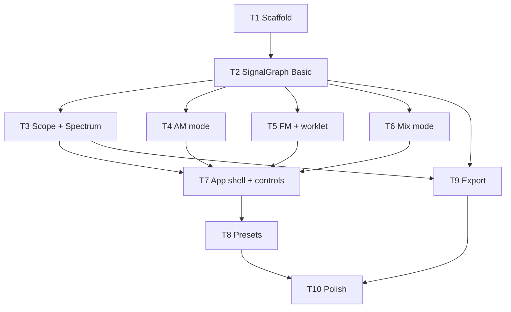

# WavePlay Implementation Plan

> **For agentic workers:** Use subagent-driven-development. Check off tasks as completed.

**Goal:** Client-only Electron app for audio-band AM/FM/mix experimentation with scope, spectrum, presets, and export.

**Architecture:** Web Audio signal graph in renderer; Canvas viz; Electron main for save dialogs only.

**Tech Stack:** Electron, electron-vite, React 19, TypeScript, Web Audio API, Canvas 2D

---

## Ticket Dependency Graph

## Tickets

| ID | Title | Depends on | Owner |
|----|-------|------------|-------|
| T1 | Electron + Vite + React scaffold | — | main | ✅ |
| T2 | SignalGraph + Basic oscillator | T1 | main | ✅ |
| T3 | Scope + Spectrum visualization | T2 | subagent | ✅ |
| T4 | AM modulation | T2 | main | ✅ |
| T5 | FM (Web Audio freq mod) | T2 | main | ✅ |
| T6 | Mix / beat mode | T2 | main | ✅ |
| T7 | App shell, mode tabs, controls UI | T3,T4,T5,T6 | main | ✅ |
| T8 | Preset JSON + picker + RF panel | T7 | subagent | ✅ |
| T9 | WAV + PNG export + IPC | T2,T3 | subagent | ✅ |
| T10 | Dark theme, README, verify build | T8,T9 | main | ✅ |

---

## T1: Scaffold

- [ ] `package.json` with electron-vite, react, electron-builder
- [ ] `electron/main.ts`, `electron/preload.ts`
- [ ] `electron.vite.config.ts`
- [ ] `src/index.html`, `src/main.tsx`, minimal `App.tsx`
- [ ] `pnpm dev` launches window

## T2: SignalGraph + Basic

- [ ] `src/audio/types.ts` — modes, params, defaults
- [ ] `src/audio/SignalGraph.ts` — context, analyser, basic osc, play/stop/volume
- [ ] `src/hooks/useSignalGraph.ts`

## T3: Visualization

- [ ] `src/viz/ScopeRenderer.ts`, `src/viz/SpectrumRenderer.ts`
- [ ] `src/components/Scope.tsx`, `src/components/Spectrum.tsx`
- [ ] rAF loop from analyser

## T4: AM

- [ ] Extend SignalGraph for AM (gain modulation)
- [ ] Envelope metadata for scope overlay

## T5: FM

- [ ] `src/audio/worklets/fm-processor.ts`
- [ ] Extend SignalGraph for FM mode

## T6: Mix

- [ ] Sum + product (ring mod) in SignalGraph

## T7: App shell

- [ ] Mode tabs, context controls, play/stop/vol, RF hint bar
- [ ] Wire all modes

## T8: Presets

- [ ] 8 JSON presets in `src/presets/`
- [ ] PresetPicker + analogy panel

## T9: Export

- [ ] `src/export/ExportService.ts` — OfflineAudioContext WAV
- [ ] IPC save dialog, PNG composite

## T10: Polish

- [ ] `src/index.css` dark bench theme
- [ ] Update README with real commands
- [ ] `pnpm build` passes
