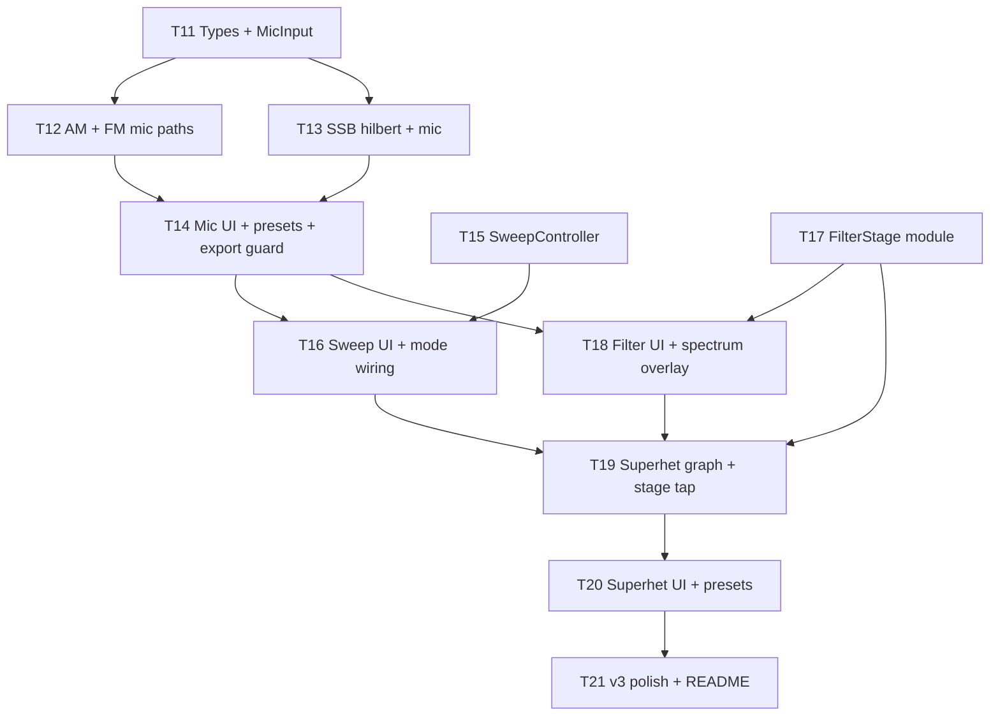

# WavePlay v3 Implementation Plan

> **For agentic workers:** Use subagent-driven-development. Check off tasks as completed. One milestone per PR recommended.

**Goal:** Mic modulator, parameter sweeps, IF filter overlay, and superheterodyne chain — per [v3 design spec](../specs/2026-05-31-waveplay-v3-design.md).

**Architecture:** Extend existing `SignalGraph` + `AnalyserNode` tap; new modules `MicInput`, `FilterStage`, `SweepController`, `SuperhetChain`. No new Electron IPC.

**Tech Stack:** Unchanged — Electron, electron-vite, React 19, TypeScript, Web Audio API, Canvas 2D

**Codebase notes (read before starting):**

- FM today uses `modulator → devGain → carrier.frequency` (no AudioWorklet yet) — mic FM can reuse that wiring with `MediaStreamSource` instead of `OscillatorNode`.
- SSB today is **pedagogical shortcut** (single osc at sideband freq), not hilbert/phasor — mic SSB requires upgrading `buildSsb` first (v2 spec intent).
- `ExportService.ts` mirrors `SignalGraph` offline — every graph change needs matching offline builder.
- Controls live inline in `App.tsx` (~600 lines) — extract shared panels during v3 to keep diffs reviewable.

---

## Ticket Dependency Graph



## Tickets

| ID | Title | Depends on | Milestone | Est. |
|----|-------|------------|-----------|------|
| T11 | Types + `MicInput` lifecycle | — | G | ½ session |
| T12 | AM + FM mic modulator paths | T11 | G | ½ session |
| T13 | SSB hilbert upgrade + mic path | T11 | G | 1 session |
| T14 | Mic UI, presets, export guard, viz | T12, T13 | G | 1 session |
| T15 | `SweepController` + tests | — | F | ½ session |
| T16 | Sweep panel + AudioParam wiring | T14, T15 | F | 1 session |
| T17 | `FilterStage` + response math | — | H | ½ session |
| T18 | Filter overlay UI + spectrum ghost | T17 | H | 1 session |
| T19 | Superhet chain + stage analyser | T17, T16 | E | 1½ session |
| T20 | Superhet diagram UI + presets | T19 | E | 1 session |
| T21 | Polish, tests, README | T20 | all | ½ session |

**Ship order:** T11–T14 (G) → T15–T16 (F) → T17–T18 (H) → T19–T20 (E) → T21

---

## T11: Types + MicInput

**Files:** `src/renderer/audio/types.ts`, `src/renderer/audio/MicInput.ts`, `src/renderer/audio/types.test.ts`

- [ ] Add `ModulatorSource = 'tone' | 'mic'`
- [ ] Extend `AmParams`, `FmParams`, `SsbParams`:
  ```typescript
  modulatorSource: ModulatorSource  // default 'tone'
  micGain: number                   // default 1, clamp 0–2
  ```
- [ ] Update `defaultSignalState()` defaults
- [ ] Create `MicInput` class:
  - `async acquire(): Promise<void>` — `getUserMedia({ audio: { echoCancellation: false, noiseSuppression: false, autoGainControl: false } })`
  - `release()` — stop all tracks, disconnect nodes
  - `createSource(ctx): MediaStreamAudioSourceNode | null`
  - `readonly levelAnalyser: AnalyserNode | null` — for RMS meter
  - `readonly active: boolean`
- [ ] Unit tests: `clampMicGain`, default params include new fields

**Verify:** `pnpm test` passes; no runtime changes yet.

---

## T12: AM + FM mic modulator paths

**Files:** `src/renderer/audio/SignalGraph.ts`, `src/renderer/audio/MicInput.ts`

- [ ] `SignalGraph` holds optional `MicInput` instance; expose `getMicInput()` or pass via constructor
- [ ] Refactor `buildAm`:
  - Tone path: unchanged
  - Mic path: `mic → micGain → modGain` (replacing modulator osc); keep carrier + `(1 + m·mod)` structure
  - Optional: `BiquadFilterNode` highpass 80 Hz on mic branch
- [ ] Refactor `buildFm`:
  - Mic path: `mic → micGain → devGain → carrier.frequency` (replace modulator osc)
  - Scale mic so speech produces sensible deviation (document gain mapping in code)
- [ ] `rebuild()` calls `micInput.release()` when switching to tone or on `stop()`
- [ ] `start(state)`: if any mode uses `modulatorSource === 'mic'`, call `micInput.acquire()` before graph build

**Verify (manual):**

- AM + Tone: unchanged vs today
- AM + Mic: speak → hear modulated carrier; OS mic indicator on while playing
- FM + Mic: speak → timbre changes with voice
- Stop → mic indicator off

---

## T13: SSB hilbert upgrade + mic path

**Files:** `src/renderer/audio/SignalGraph.ts`, `src/renderer/audio/hilbert.ts` (new), `src/renderer/audio/hilbert.test.ts`

Replace simplified side-osc SSB with phasor implementation (v2 spec):

- [ ] `hilbert.ts` — 4-stage allpass chain factory `(ctx, input) → { i, q }` or documented approximation
- [ ] `buildSsb` rewrite:
  - Tone: voice osc → hilbert → USB/LSB combine with carrier osc
  - Mic: same chain from `MediaStreamSource`
  - Pilot carrier unchanged
- [ ] Unit test: 100 Hz tone → I/Q phase ~90° (sample-based test, tolerance ±15°)
- [ ] Update `getVizHints` for SSB if sideband freq math changes
- [ ] Update `ExportService.buildSsbOffline` to match new chain (tone only)

**Verify:** Existing SSB presets (`ssb-usb`, `ssb-lsb`, `ssb-pilot`) still sound correct; spectrum shows expected sideband.

---

## T14: Mic UI, presets, export guard, viz

**Files:** `src/renderer/components/ModulatorSourcePanel.tsx` (new), `src/renderer/App.tsx`, `src/renderer/index.css`, `src/renderer/presets/*.json`, `src/renderer/presets/index.ts`, `src/renderer/export/ExportService.ts`, `src/renderer/viz/ScopeRenderer.ts`, `src/renderer/audio/types.ts`

### UI (`ModulatorSourcePanel`)

- [ ] Extract component: Tone | Mic toggle, mic gain slider, peak meter (reads `MicInput.levelAnalyser` via rAF), red ● “Live” when mic active
- [ ] Render in AM, FM, SSB control sections
- [ ] Permission error inline + “Use tone instead” fallback
- [ ] Headphones hint in RF panel when mic enabled

### Viz

- [ ] When AM + mic: envelope overlay uses **mic RMS** (from level analyser, smoothed) instead of sine math
- [ ] Extend `getVizHints` rfHint for mic: *“Your voice modulates the carrier…”*

### Presets (3 new JSON + index)

- [ ] `am-mic-voice.json` — AM, mic, m=0.8, carrier 1000
- [ ] `fm-mic-speech.json` — FM, mic, carrier 440, deviation 100
- [ ] `ssb-mic-usb.json` — SSB USB, mic, carrier 1000

### Export guard

- [ ] `exportWav` / export button: if `modulatorSource === 'mic'`, disable with `title` tooltip *“WAV export requires tone modulator (v3.0)”*
- [ ] Screenshot still allowed in mic mode

### Quiz

- [ ] Ensure quiz presets never use mic source (no JSON changes if defaults are tone)

**Verify:** Load `am-mic-voice` preset → Play → speak → sidebands visible; Export WAV disabled; screenshot works.

---

## T15: SweepController

**Files:** `src/renderer/audio/SweepController.ts`, `src/renderer/audio/SweepController.test.ts`, `src/renderer/audio/sweepTypes.ts` (new)

- [ ] Types:
  ```typescript
  interface SweepConfig {
    enabled: boolean
    paramKey: string   // dot path, e.g. 'am.modulationIndex'
    from: number
    to: number
    durationSec: number
    loop: boolean
  }
  ```
- [ ] `SweepController`:
  - `start(config, getCurrent, onValue)` — rAF or 30 Hz timer
  - `stop()` — hold current value
  - `getValueAt(t)` — linear interpolation for tests
  - `currentValue` getter
- [ ] `SWEEPABLE_PARAMS` map: mode → allowed param keys + default from/to
- [ ] Unit tests: t=0, t=duration/2, t=duration; loop wrap

**Verify:** `pnpm test` — sweep math only, no UI yet.

---

## T16: Sweep panel + mode wiring

**Files:** `src/renderer/components/SweepPanel.tsx` (new), `src/renderer/hooks/useSweep.ts` (new), `src/renderer/App.tsx`, `src/renderer/audio/SignalGraph.ts`, `src/renderer/index.css`

- [ ] Collapsible `SweepPanel`: enable, param dropdown (mode-aware), from/to, duration select, loop
- [ ] `useSweep` hook:
  - Owns `SweepController` ref
  - On tick: update React state for UI + call `SignalGraph` sweep hooks
- [ ] **AudioParam targets** (avoid full rebuild each frame):
  - AM `modulationIndex` → schedule `modGain.gain` ramps (store node refs on `SignalGraph` or callback registry)
  - FM `deviationHz` → schedule `devGain.gain` ramps
  - Mix `oscBHz` → `oscB.frequency` ramps
- [ ] Full rebuild acceptable for: filter bandwidth (T18), superhet LO (T19)
- [ ] Stop sweep on: Stop button, mode change, disable toggle
- [ ] While sweeping: disable manual slider for swept param (show live value)
- [ ] First enable: one-time hint *“Try Waterfall tab”* (CSS toast or rf-panel line)

**Verify:**

- AM sweep 0→100% over 10 s: sidebands grow on spectrum + waterfall
- Stop mid-sweep: holds value, no click
- FM deviation sweep: audible + visible spread

---

## T17: FilterStage module

**Files:** `src/renderer/audio/FilterStage.ts`, `src/renderer/audio/filterResponse.ts`, `src/renderer/audio/filterResponse.test.ts`, `src/renderer/audio/types.ts`

- [ ] Add to `SignalState`:
  ```typescript
  interface FilterParams {
    enabled: boolean
    centerHz: number
    bandwidthHz: number
  }
  filter: FilterParams  // default disabled, center 1000, bw 2400
  ```
- [ ] `FilterStage.connect(ctx, input, params): { output, dispose }`
  - `BiquadFilterNode` type `bandpass`
  - `Q = centerHz / bandwidthHz`
  - Bypass when disabled (input → output direct)
- [ ] `computeBandpassResponse(center, bw, sampleRate, binCount): Float32Array` — magnitude per FFT bin for overlay
- [ ] `clampFilterParams()` helpers
- [ ] Unit tests: Q formula; response peak near center

**Verify:** `pnpm test` passes.

---

## T18: Filter overlay UI + spectrum ghost

**Files:** `src/renderer/components/FilterPanel.tsx` (new), `src/renderer/App.tsx`, `src/renderer/audio/SignalGraph.ts`, `src/renderer/viz/SpectrumRenderer.ts`, `src/renderer/viz/Spectrum.tsx`, `src/renderer/export/ExportService.ts`, `src/renderer/presets/*.json`, `src/renderer/index.css`

### Graph

- [ ] All modes: mode output → `FilterStage` → `masterGain` (single insertion point in `SignalGraph`)
- [ ] `updateParams` handles filter center/bw without full mode rebuild when possible (`filterNode.frequency`, `filterNode.Q`)

### UI

- [ ] `FilterPanel`: enabled toggle, center Hz, bandwidth Hz, **Track carrier** button (sets center from mode carrier freq)
- [ ] Show on all study modes (including superhet later — separate IF filter in T19)

### Spectrum

- [ ] Pass `filterResponse?: Float32Array` to `SpectrumRenderer`; draw semi-transparent amber fill when filter enabled
- [ ] RF hint when enabled: *“455 kHz IF filter — here at audio Hz…”*

### Presets (3 new)

- [ ] `filter-ssb-2k4.json` — SSB USB + filter enabled 2400 Hz BW
- [ ] `filter-narrow-muffled.json` — AM 100% + 400 Hz BW (muffled demo)
- [ ] `filter-wide-am.json` — AM + 6000 Hz BW

### Export

- [ ] `buildOfflineGraph` inserts filter stage when `state.filter.enabled`

### Sweep (from T16)

- [ ] Add `filter.bandwidthHz` to sweepable params

**Verify:** USB preset + 300 Hz BW → muffled audio; ghost curve on spectrum; sweep BW on waterfall.

---

## T19: Superhet chain + stage analyser

**Files:** `src/renderer/audio/types.ts`, `src/renderer/audio/SuperhetChain.ts` (new), `src/renderer/audio/SignalGraph.ts`, `src/renderer/audio/types.test.ts`, `src/renderer/export/ExportService.ts`

### Types

- [ ] `SignalMode` add `'superhet'`
- [ ] `SuperhetParams`: `rfCarrierHz`, `rfModHz`, `modulationIndex`, `loHz`, `ifCenterHz`, `ifBandwidthHz`
- [ ] `DEFAULT_SUPERHET`, `getVizHints` case with stage-aware labels
- [ ] `SuperhetStage = 'rf' | 'mixer' | 'if' | 'demod' | 'audio'`

### Graph (`SuperhetChain.ts`)

```
RF AM (reuse AM subgraph) ──┐
                            ├─ product mix ── IF FilterStage ── envelope demod ── out
LO osc ─────────────────────┘
```

- [ ] `buildSuperhet(ctx, params, masterGain): { dispose, setStageTap, getStageAnalyser }`
- [ ] Demod: envelope follower — `WaveShaperNode` abs approx or `GainNode` + rectification worklet; LPF ~150 Hz
- [ ] **Single analyser, reconnect tap** on stage change (avoid 5 FFTs)
- [ ] `SignalGraph.setSuperhetStage(stage)` switches analyser input
- [ ] Helper `suggestIfCenter(rfCarrier, lo) => Math.abs(rfCarrier - lo)`
- [ ] Sweep target: `superhet.loHz` (optional in T16 if not done)

### Export

- [ ] `buildSuperhetOffline` — tone RF only; full chain

**Verify (manual):**

- Mixer stage: products visible in spectrum
- Demod stage: ~100 Hz baseband visible when RF AM 1000/100
- Wrong IF center → quiet demod output

---

## T20: Superhet diagram UI + presets

**Files:** `src/renderer/components/SuperhetDiagram.tsx` (new), `src/renderer/App.tsx`, `src/renderer/index.css`, `src/renderer/presets/*.json`, `src/renderer/presets/index.ts`, `src/renderer/quiz/quizEngine.ts` (add superhet to guess list if desired — optional v3.1)

### UI

- [ ] Mode tab **Superhet**
- [ ] Block diagram row above scope: `[ RF ] → [ Mixer ] → [ IF ] → [ Demod ] → [ Audio ]`
  - Click stage → `graph.setSuperhetStage(stage)` + highlight active block
  - Per-block level meter (cheap peak from time domain slice)
- [ ] Controls: RF carrier/mod/m, LO Hz, IF center/bw, **Sync IF to |RF−LO|** button
- [ ] RF analogy panel copy per stage (static strings or stage-dependent hint)

### Presets (3 new)

- [ ] `superhet-classic-am.json`
- [ ] `superhet-if-narrow.json` — narrow IF BW preset
- [ ] `superhet-lo-sweep.json` — LO offset for image lesson (companion copy in rfAnalogy)

### Quiz

- [ ] Defer superhet quiz questions to v3.1 (out of scope per spec)

**Verify:** Click each stage → scope/spectrum content changes; preset loads and plays; IF filter panel affects demod.

---

## T21: Polish, tests, README

**Files:** `README.md`, `docs/superpowers/specs/2026-05-31-waveplay-v3-design.md`, test files as needed

- [ ] Update README features list (mic, sweep, filter, superhet)
- [ ] Link v3 spec + this plan from README docs section
- [ ] Set v3 design spec status → **Implemented**
- [ ] `pnpm test` green
- [ ] `pnpm build` green
- [ ] Manual smoke script (below) passes
- [ ] Mark all ticket checkboxes in this file

### Manual smoke (v3)

1. **Mic:** AM mic preset → speak → Stop → mic indicator off  
2. **Sweep:** FM deviation 10 s loop + waterfall visible  
3. **Filter:** Narrow BW on SSB → muffled + ghost curve  
4. **Superhet:** Click Mixer vs Demod → different spectra  
5. **Export:** WAV with filter on; WAV disabled with mic; PNG always works  
6. **Quiz:** Still works; no mic presets in pool  

---

## File touch summary (new / major edit)

| Path | Tickets |
|------|---------|
| `src/renderer/audio/MicInput.ts` | T11 |
| `src/renderer/audio/hilbert.ts` | T13 |
| `src/renderer/audio/SweepController.ts` | T15 |
| `src/renderer/audio/FilterStage.ts` | T17 |
| `src/renderer/audio/filterResponse.ts` | T17 |
| `src/renderer/audio/SuperhetChain.ts` | T19 |
| `src/renderer/components/ModulatorSourcePanel.tsx` | T14 |
| `src/renderer/components/SweepPanel.tsx` | T16 |
| `src/renderer/components/FilterPanel.tsx` | T18 |
| `src/renderer/components/SuperhetDiagram.tsx` | T20 |
| `src/renderer/hooks/useSweep.ts` | T16 |
| `src/renderer/audio/SignalGraph.ts` | T12–T19 |
| `src/renderer/audio/types.ts` | T11, T17, T19 |
| `src/renderer/App.tsx` | T14, T16, T18, T20 |
| `src/renderer/export/ExportService.ts` | T13, T18, T19 |
| `src/renderer/viz/SpectrumRenderer.ts` | T18 |
| `src/renderer/presets/*.json` | T14, T18, T20 |

---

## PR strategy

| PR | Tickets | Title |
|----|---------|-------|
| 1 | T11–T14 | feat: mic-as-modulator (Milestone G) |
| 2 | T15–T16 | feat: parameter sweeps (Milestone F) |
| 3 | T17–T18 | feat: IF bandpass filter (Milestone H) |
| 4 | T19–T20 | feat: superheterodyne chain (Milestone E) |
| 5 | T21 | chore: v3 polish + docs |

PR 1 is the user priority — merge before others if time-constrained.

---

## Unresolved Qs

1. **SSB hilbert in T13:** If allpass phase test flaky, ship mic AM+FM in PR1 and mic SSB in PR1 follow-up?  
2. **App.tsx split:** Extract mode control sections to `components/Controls/AmControls.tsx` etc. during T14 or defer to T21?  
3. **Superhet demod quality:** Envelope follower vs small AudioWorklet — start with `WaveShaperNode` abs + lowpass?  
4. **Quiz + superhet:** Add to `QUIZ_GUESS_MODES` in v3.0 or wait for question bank content?
