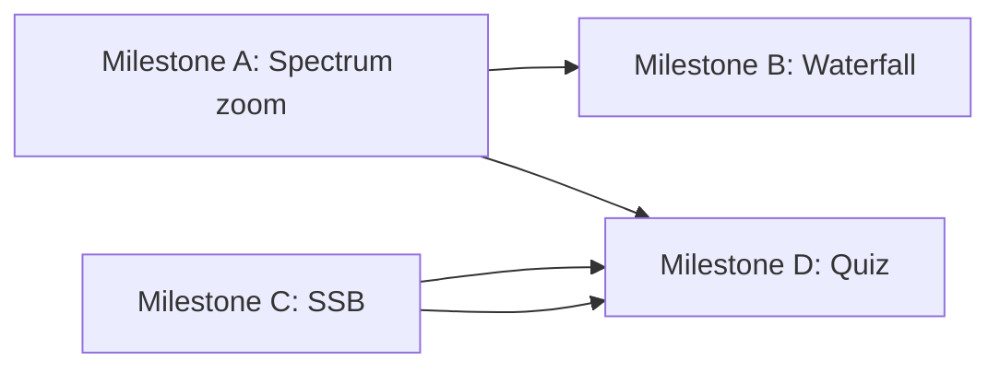

# WavePlay v2 — Post-v1 Design

**Date:** 2026-05-31  
**Status:** Draft  
**Depends on:** [v1 spec](./2026-05-31-waveplay-design.md)

## Summary

Four learning features that extend WavePlay beyond the v1 sandbox: time–frequency depth (waterfall), a mode not yet modeled (SSB), active recall (quiz), and finer spectrum control (zoom). Each is independent enough to ship as its own milestone.

## Principles (carry forward from v1)

- Audio-band only — RF concepts via analogy text, not MHz tuning
- Client-only Electron, Web Audio + Canvas (WebGL only where Canvas is insufficient)
- Every feature must be hearable and visible; presets explain the RF mapping

---

## Milestone A: Zoomable frequency axis

**Problem:** Fixed 0–5 kHz linear spectrum hides detail when studying narrow sidebands or low beat frequencies.

### UX

- Spectrum panel toolbar: **Zoom in / out / reset**, **Pan** (drag or shift+scroll)
- Double-click a peak to center and zoom to ±50 Hz (or ±2× sideband spacing)
- Status readout: `view: 980–1020 Hz` under spectrum

### Implementation

| Piece | Approach |
|-------|----------|
| View state | `SpectrumView { minHz, maxHz }` in React; default 0–5000 |
| Renderer | `SpectrumRenderer` maps bin index → screen X using view window, not fixed MAX_FREQ |
| Labels | Filter `spectrumLabels` to visible range; reposition markers |
| Performance | Same 4096 FFT; no recompute — only changes X mapping |
| Export | Screenshot includes current view range in metadata |

### Acceptance

- Zoom to 100 Hz span around 1 kHz AM carrier; LSB/USB labels remain aligned with peaks
- Pan does not desync from live audio

**Effort:** ~1 session. No new audio nodes.

---

## Milestone B: Waterfall spectrogram

**Problem:** FFT snapshot shows *now*; waterfall shows *how spectrum evolves* — useful for FM deviation sweeps and beat buildup.

### UX

- Third viz slot or tab: **Scope | Spectrum | Waterfall**
- Y = frequency (same zoom as Milestone A), X = time (scroll left), color = dB
- Classic amber-on-black palette; 10–20 s history at 30 fps

### Implementation

| Piece | Approach |
|-------|----------|
| Buffer | Ring buffer `Uint8Array[historyWidth × freqBins]` in `WaterfallRenderer` |
| Source | Same `AnalyserNode` FFT as spectrum |
| Render | Canvas 2D first (column per frame); upgrade to WebGL if frame drops |
| Memory | ~800×256 ≈ 200 KB — trivial |
| CPU | Reuse float FFT buffer; quantize to 0–255 relative dB |

### Acceptance

- FM wide preset shows sideband “wiggle” over time
- Beat preset shows stable f1/f2 lines plus slow amplitude modulation visible as brightness pulsing at beat rate

**Effort:** ~1–2 sessions. Optional WebGL polish later.

---

## Milestone C: SSB demonstration

**Problem:** Ham ops use SSB daily; v1 only covers AM/FM. SSB is the natural next modulation story.

### Pedagogy

- Compare **AM**, **USB**, **LSB** on same 1 kHz carrier + 100 Hz “voice” tone
- Spectrum: AM shows carrier + both sidebands; SSB shows one sideband, suppressed carrier
- RF analogy panel explains bandwidth and why SSB wins on HF

### Signal chain (Web Audio)

```
voice osc → hilbert (90° shift) →
  USB: I*cos(ωc) - Q*sin(ωc)   (or phasor implementation)
  LSB: I*cos(ωc) + Q*sin(ωc)
```

| Piece | Approach |
|-------|----------|
| Hilbert | Biquad allpass chain (4 stages) or small AudioWorklet; validate with 100 Hz test tone |
| Modes | Extend `SignalMode`: `'ssb-usb' | 'ssb-lsb'` or sub-mode under `'ssb'` |
| Carrier control | Optional `-20 dB pilot` toggle to show re-inserted carrier vs suppressed |
| Presets | "SSB vs AM bandwidth", "Why no carrier on SSB" |

### Risks

- Hilbert quality at audio rates — test with scope (should be ~90° between I/Q)
- CPU — acceptable for single channel

**Effort:** ~2–3 sessions (DSP + UI + presets).

---

## Milestone D: Quiz mode

**Problem:** Sandbox is open-loop; quiz adds closed-loop recall for exam / license study.

### UX

- **Study → Quiz** toggle in header
- Round flow:
  1. App picks random hidden preset (or synthetic params)
  2. Audio plays 3–5 s; user sees scope + spectrum (no mode label)
  3. User selects: AM / FM / CW / Mix / SSB (when available)
  4. Reveal + RF explanation; optional “show settings”
- Score: streak + session summary

### Implementation

| Piece | Approach |
|-------|----------|
| Question bank | Extend preset JSON with `quiz?: { difficulty, distractors }` or generate from param ranges |
| State machine | `QuizSession { question, score, streak, phase: 'listen'|'guess'|'reveal' }` |
| Anti-cheat | Hide mode tabs during listen; don’t expose params until reveal |
| Audio | Reuse `SignalGraph`; same export path not needed |

### Question types (v2.0)

1. **Identify modulation** — primary
2. **Identify beat frequency** — mix mode, user picks closest Hz (multiple choice)
3. **Sideband count** — AM vs FM vs CW after reveal

### Acceptance

- 10-question session without UI bugs
- Every question has RF analogy on reveal

**Effort:** ~2 sessions UI + 1 session content.

---

## Recommended build order



1. **A (zoom)** — unblocks waterfall Y-axis and quiz spectrum reading  
2. **C (SSB)** — highest ham-radio learning value  
3. **B (waterfall)** — visual polish, reuses A’s freq axis  
4. **D (quiz)** — needs stable modes including SSB; benefits from zoom

---

## Out of scope for v2

- Real RF / SDR / rig control
- Morse keyer input (user types CQ)
- Multi-user / sharing
- Mobile / web-only build

---

## Open questions

1. **SSB first or waterfall first?** — Recommend SSB for study value; waterfall for wow-factor  
2. **Quiz gamification** — streak only, or spaced repetition deck?  
3. **WebGL mandatory for waterfall?** — Start Canvas 2D; profile on M1 Mac before upgrading
