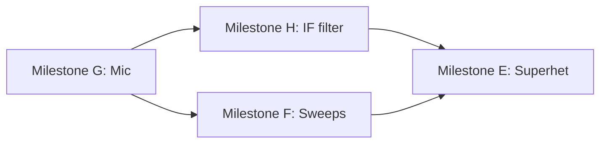

# WavePlay v3 — Proposal & Design

**Date:** 2026-05-31  
**Status:** Implemented (2026-05-31)  
**Depends on:** [v1 spec](./2026-05-31-waveplay-design.md), [v2 spec](./2026-05-31-waveplay-v2-design.md)

## Summary

Four features that turn WavePlay from a **modulation sandbox** into a **receiver/transmit lab**:

| Milestone | Feature | One-line value |
|-----------|---------|----------------|
| **G** | Mic-as-modulator | Hear *your voice* as sidebands — the “aha” moment |
| **F** | Parameter sweeps | Watch deviation, modulation index, and bandwidth evolve in time |
| **H** | IF / bandpass filter | Why SSB sounds crisp and AM sounds wide — with knobs |
| **E** | Superheterodyne chain | Mix → IF → demod as a clickable block diagram |

Each milestone ships independently. **G is the flagship** (user priority). **H unblocks E.** **F amplifies waterfall** and pairs with every mode.

## Principles (carry forward)

- Audio-band only — MHz/kHz labels are **analogy text**, not tuning ranges
- Client-only Electron; Web Audio + Canvas; mic via `getUserMedia` only
- Hearable + visible + labeled; RF analogy panel on every preset and mode
- Reuse `SignalGraph`, `AnalyserNode` tap, spectrum zoom, waterfall — no parallel audio stacks

## Architecture impact (high level)

```
┌─────────────────────────────────────────────────────────────┐
│  Renderer (existing)                                          │
│  + ModulatorSource toggle (tone | mic)                        │
│  + FilterStage controls (optional overlay or superhet stage)  │
│  + SweepController (param animation)                          │
│  + SuperhetDiagram (stage-selectable analyser tap)            │
├─────────────────────────────────────────────────────────────┤
│  SignalGraph (extended)                                       │
│  ┌─────────────┐  ┌──────────────┐  ┌─────────────────────┐ │
│  │ MicInput    │  │ FilterStage  │  │ SuperhetChain       │ │
│  │ MediaStream │  │ Biquad BP    │  │ RF→Mix→IF→Demod     │ │
│  └──────┬──────┘  └──────┬───────┘  └──────────┬──────────┘ │
│         └────────────────┴───────────────────────┘            │
│                              │                                │
│                    masterGain → analyser → destination        │
└─────────────────────────────────────────────────────────────┘
```

New modules (proposed):

| Module | Responsibility |
|--------|----------------|
| `MicInput` | Permission, stream lifecycle, level meter, replace modulator osc |
| `FilterStage` | Bandpass biquad; Q from bandwidth; optional spectrum overlay |
| `SweepController` | Time-varying params via AudioParam ramps + worklet port |
| `SuperhetChain` | Multi-stage graph with per-stage analyser taps |
| `SuperhetDiagram` | SVG/canvas block diagram; stage selection → viz source |

---

## Milestone G: Mic-as-modulator ★

**Problem:** Internal sine “voice” explains math but doesn’t connect to the user’s body / mic / real speech formants. License study sticks when learners recognize *their own* sidebands.

**Pedagogy:** “You are the baseband. The carrier is the rig. Everything you say becomes sideband energy around fc.”

### UX

- **Modulator source** toggle on AM, FM, and SSB panels: `Tone` | `Mic`
- Mic path:
  - **Enable mic** button → browser permission prompt (first time)
  - **Input level** bar (peak meter, green/yellow/red)
  - **Mic gain** slider (0–2×, default 1) — pre-modulation, not master volume
  - Red **● REC** indicator when stream active (not recording to disk — “live only”)
- Scope: AM envelope derived from **mic RMS** (smoothed) when mic mode; FM/SSB spectrum shows speech sidebands
- RF analogy (dynamic): *“Your voice (300–3000 Hz at RF) modulates the carrier. Here, speech formants land on fc ± fm.”*
- Quiz: exclude mic mode in v3.0 (synthetic presets only)

### Signal chain

```
getUserMedia → MediaStreamSource → micGain → [high-pass ~80 Hz optional]
                                              ↓
                    AM:  modulator path (replaces OscillatorNode)
                    FM:  worklet mod input (replaces internal mod osc)
                    SSB: hilbert I/Q from mic (replaces voice osc)
```

| Piece | Approach |
|-------|----------|
| Permission | `navigator.mediaDevices.getUserMedia({ audio: { echoCancellation: false, noiseSuppression: false } })` — disable processing for honest spectrum |
| Lifecycle | Start stream on Mic toggle + Play; stop tracks on Stop / switch to Tone / unmount |
| Level meter | `AnalyserNode` on mic branch; RMS in rAF; no recording |
| AM modulator | Existing `(1 + m·mod)` gain path; mod signal = mic × m |
| FM modulator | Extend FM worklet: `modSample` from mic buffer instead of internal sine |
| SSB | Mic → hilbert chain (reuse v2 SSB); validate I/Q phase with 100 Hz test before mic |
| Export WAV | **Offline render cannot use live mic** — disable export in mic mode OR export last N seconds of captured ring buffer (defer ring buffer to v3.1; v3.0: disable with tooltip) |
| Errors | No device / permission denied → inline message; fall back to Tone |

### Params (extend existing)

```typescript
type ModulatorSource = 'tone' | 'mic'

interface AmParams {
  // existing...
  modulatorSource: ModulatorSource
  micGain: number
}
// Same fields on FmParams, SsbParams
```

### Presets (minimum)

1. **AM — your voice on 1 kHz** — mic, m = 0.8, carrier 1000 Hz  
2. **FM — speech on 440 Hz** — mic, deviation 100 Hz  
3. **USB — hear yourself single-sideband** — mic, carrier 1000 Hz, USB  

### Acceptance

- User speaks; AM scope envelope follows speech; spectrum shows sidebands around carrier  
- Switch Tone ↔ Mic without restart glitch (< 50 ms crossfade on mod path)  
- Mic stops when app Stop pressed; no orphaned stream (verify in Activity Monitor / OS mic indicator)  
- Permission denied shows clear recovery path  

### Risks

| Risk | Mitigation |
|------|------------|
| FM worklet + mic buffer underrun | Small ring buffer in worklet; hold last sample on underrun |
| SSB hilbert on wideband speech | High-pass 80–100 Hz on mic; RF analogy mentions bass cut |
| Feedback if speakers loud | Default moderate volume; hint to use headphones |

**Effort:** ~2 sessions (audio plumbing + UI meter + 3 presets)

---

## Milestone F: Parameter sweeps

**Problem:** Static sliders hide *relationships* — sideband amplitude vs *m*, FM spectrum vs deviation, filter passband vs muffled audio. Waterfall already shows time; sweeps **drive** time intentionally.

### UX

- **Sweep** panel (collapsible) below mode controls:
  - Enable toggle
  - **Target param** dropdown (mode-aware; see table below)
  - **From / To** (numeric; seeded from current value)
  - **Duration** 2 / 5 / 10 / 20 s
  - **Loop** checkbox
  - **Shape** `linear` | `sine` (v3.0 linear only; sine v3.1)
- While sweeping: param slider read-only but **follows** live value; waterfall encouraged (tab hint on first enable)
- Stop sweep on Play→Stop or mode change

### Sweepable params (v3.0)

| Mode | Param | From → To (defaults) |
|------|-------|----------------------|
| AM | `modulationIndex` | 0 → 1 |
| FM | `deviationHz` | 0 → 300 |
| Mix | `oscBHz` | f1 → f1+20 (beat sweep) |
| SSB | `modulatorHz` | 50 → 300 (tone only) |
| Filter overlay | `bandwidthHz` | 200 → 3000 |
| Mic | `micGain` | 0.5 → 1.5 (when Milestone G shipped) |

### Implementation

| Piece | Approach |
|-------|----------|
| Controller | `SweepController` class: `start(config)`, `stop()`, emits `onValue(param, t)` |
| AudioParam targets | AM `modGain.gain`, carrier freq where safe — use `linearRampToValueAtTime` on scheduled timeline |
| Worklet targets | FM deviation, superhet LO — `port.postMessage({ deviationHz })` each frame or 30 Hz throttle |
| React sync | Controller updates `SignalState` at 10 Hz for UI labels only; audio leads via ramps |
| Loop | `OfflineAudioContext`-style loop: reset timeline + cancelScheduledValues on wrap |
| Viz | `getVizHints` reads current swept value from controller ref for envelope/labels |

```typescript
interface SweepConfig {
  enabled: boolean
  paramKey: string        // e.g. 'am.modulationIndex'
  from: number
  to: number
  durationSec: number
  loop: boolean
}
```

### Acceptance

- AM sweep 0→100% m over 10 s: sideband labels track; waterfall shows brightening sidebands  
- FM deviation sweep: audible timbre change + spectrum spread visible  
- Disable sweep mid-run: param holds current value, no graph pop  
- Unit test: sweep timeline math (value at t=0, t=duration/2, t=duration)

**Effort:** ~1–2 sessions

---

## Milestone H: IF / bandpass filter

**Problem:** Learners hear “narrow filter” in theory but never **mis-tune** one. Filter demo connects SSB bandwidth, AM broadcast width, and superhet IF selectivity.

### UX

Two surfaces (same `FilterStage` engine):

1. **Filter overlay** — toggle on AM / FM / SSB / Basic: `Filter off` | `Filter on`  
2. **Superhet stage** — IF filter is a dedicated block (Milestone E)

Controls when enabled:

- **Center frequency** Hz (20–4000)
- **Bandwidth** Hz (100–4000) — UI primary; Q derived internally
- **Listen** — post-filter audio (default on)
- Spectrum: **ghost curve** of filter magnitude response (computed biquad H(f), not FFT)
- RF analogy: *“455 kHz IF crystal filter — here centered at 500 Hz so you can hear the skirts.”*

### Signal chain

```
mode output → FilterStage (BiquadFilterNode bandpass) → masterGain
```

| Piece | Approach |
|-------|----------|
| Filter | `BiquadFilterNode`, type `bandpass`; `frequency = centerHz`, `Q = centerHz / bandwidthHz` |
| Response overlay | `computeBandpassResponse(center, bw, bins)` in TS; draw semi-transparent on spectrum canvas |
| Auto center | Button **Track carrier** sets center to dominant peak (AM carrier / FM carrier) |
| Presets | “SSB 2.4 kHz”, “AM broadcast 6 kHz”, “Muffled — filter too narrow” |

### Params

```typescript
interface FilterParams {
  enabled: boolean
  centerHz: number
  bandwidthHz: number
}

interface SignalState {
  // existing...
  filter: FilterParams
}
```

Default: `{ enabled: false, centerHz: 1000, bandwidthHz: 2400 }`

### Acceptance

- USB preset + 300 Hz bandwidth: sideband heavily attenuated; audible muffling  
- Response ghost curve peaks at center; aligns with live spectrum peak when filter centered on carrier  
- Filter + mic mode: speech band limited predictably  
- Export WAV includes filter when enabled (OfflineAudioContext chain match)

**Effort:** ~1–2 sessions

---

## Milestone E: Superheterodyne chain

**Problem:** Mix mode shows *one* multiplication. Real receivers chain **RF → mixer → IF filter → demod**. Learners need to click through stages and hear/see each output.

**Pedagogy:** Map audio frequencies to labeled blocks:

| Block label (UI) | Audio Hz (example) | RF analogy text |
|------------------|-------------------|-----------------|
| RF input | 1000 Hz carrier, 100 Hz AM | “10 MHz station” |
| Local oscillator | 1200 Hz | “LO at 10.2 MHz” |
| Mixer output | sum/diff products | “Products at IF and image” |
| IF filter | bandpass @ 200 Hz, 200 Hz BW | “455 kHz IF filter” |
| Demod audio | ~100 Hz envelope | “Detected baseband — your speaker” |

### UX

- New mode tab: **Superhet** (after Mix)
- **Block diagram** row above scope (horizontal):

  `[ RF ] → [ Mixer ] → [ IF ] → [ Demod ] → [ Audio ]`

  - Click stage to route **scope + spectrum** to that tap (highlight active block)
  - Small live level meter per block
- Controls:
  - RF: carrier Hz, mod Hz, modulation index (AM RF signal)
  - LO: frequency Hz
  - IF: center Hz (default `|RF − LO|`), bandwidth Hz (reuse FilterStage)
  - Demod: `AM envelope` only in v3.0
- Auto-sync IF center to `|carrierHz − loHz|` button
- Presets:
  1. **Classic AM superhet** — hear 100 Hz audio after IF strip  
  2. **Image rejection intuition** — two LO settings, same IF (companion preset copy)  
  3. **IF too narrow** — same as F but in superhet context  

### Signal chain (Web Audio)

```
RF AM generator:
  carrier osc × (1 + m·mod osc)  ──┐
                                     ├──× (product) ──→ IF bandpass ──→ AM demod ──→ masterGain
LO osc ─────────────────────────────┘
         (Mixer: GainNode + DC offset product, or dedicated worklet)

Per-stage taps:
  each stage output → GainNode (tap) → StageAnalyser[stage]
  UI-selected stage → main analyser (or switch analyser connection)
```

| Piece | Approach |
|-------|----------|
| RF stage | Reuse `buildAm` subgraph; output node exposed |
| Mixer | Reuse Mix **product** path: `rf * lo` with scale normalization |
| IF | `FilterStage` centered on IF (Milestone H) |
| Demod | Envelope follower: `|signal|` → lowpass ~150 Hz; or reuse AM-style detector worklet |
| Stage viz | `SuperhetDiagram` component; `SignalGraph.getAnalyserForStage(stage)` |
| Labels | `getVizHints` returns stage-specific spectrum labels (products at mixer, IF peak, audio fundamental) |

### Params

```typescript
interface SuperhetParams {
  rfCarrierHz: number
  rfModHz: number
  modulationIndex: number
  loHz: number
  ifCenterHz: number
  ifBandwidthHz: number
}

type SignalMode = /* existing */ | 'superhet'
```

### Acceptance

- Select **Mixer** stage: spectrum shows f1±f2 product lines; select **Demod**: spectrum shows baseband mod frequency  
- IF bandwidth sweep (via Milestone F) narrows demod output audibly  
- IF center mismatched → demod output nearly silent; RF analogy explains mistuned IF  
- 10-minute session: no memory leak switching stages  

### Risks

| Risk | Mitigation |
|------|------------|
| Multiple analysers CPU | One analyser; reconnect tap on stage change (not 5 permanent FFTs) |
| Demod quality | Tune envelope LPF cutoff; preset with known 100 Hz mod for A/B |

**Effort:** ~3 sessions (graph + diagram UI + presets + stage routing)

**Depends on:** Milestone H (IF filter)

---

## Cross-feature interactions

| Combo | Behavior |
|-------|----------|
| Mic + sweep | Sweep `micGain` while user speaks — dramatic level ride |
| Mic + filter | Speech band-limited before modulation (teach bass cut / ESSB) |
| Sweep + waterfall | Primary intended pairing — enable sweep hint when waterfall visible |
| Superhet + sweep | Sweep LO Hz → IF peak walks in spectrum (Milestone F target: `superhet.loHz`) |
| Superhet + mic | **v3.1** — mic as RF modulator; v3.0 uses tone-only RF |

---

## Recommended build order



1. **G (Mic)** — flagship; immediate user delight; validates worklet + SSB with real audio  
2. **F (Sweeps)** — quick win; makes waterfall + existing modes teaching tools  
3. **H (Filter)** — reusable block; presets stand alone before superhet exists  
4. **E (Superhet)** — composes Mix + H + demod; capstone architecture lesson  

Parallel track possible: **G** and **H** independent after week 1.

---

## Testing strategy

| Milestone | Unit | Manual |
|-----------|------|--------|
| G | Mic gain clamp; mod source state machine | Speak AM/SSB; OS mic indicator clears on Stop |
| F | Sweep value at t; loop wrap | AM m sweep + waterfall recording |
| H | Q from bandwidth; H(f) overlay points | Narrow filter on USB preset |
| E | IF center = \|RF−LO\| helper | Click each block; spectrum matches stage theory |

---

## Out of scope for v3

- Real SDR / rig CAT control  
- Recording mic to disk / voicemail export (export uses tone fallback in v3.0)  
- Image-rejection full simulation (two RF paths) — preset copy only  
- Morse keyer (still v4 candidate)  
- Quiz questions for superhet / filter (v3.1 content)

---

## Open questions

1. **Mic + export:** Ship v3.0 with export disabled in mic mode, or implement 3 s ring buffer for offline WAV?  
   → Recommend **disable + tooltip** for v3.0; ring buffer v3.1 if users ask.

2. **Filter overlay default on SSB preset load?**  
   → **Off by default**; preset button “Apply SSB filter” sets 2400 Hz BW.

3. **Superhet demod beyond AM?**  
   → v3.0 **AM envelope only**; FM discriminator deferred (needs different detector + pedagogy).

4. **Sweep rebuild vs AudioParam?**  
   → Prefer **AudioParam ramps** for AM/FM where possible; full rebuild only on mode/filter topology change.

5. **Mic processing flags?**  
   → Default **off** (echoCancellation, noiseSuppression, autoGainControl: false) for honest sidebands; optional “clean speech” toggle v3.1.

---

## Success criteria (v3 complete)

| Goal | Measure |
|------|---------|
| Personal connection | User hears own voice as USB sidebands without tutorial |
| Time dynamics | 10 s FM deviation sweep visible on waterfall |
| Filter intuition | User can explain muffled SSB after narrowing BW to 400 Hz |
| Receiver story | User can click Mixer → IF → Demod and describe each spectrum |
